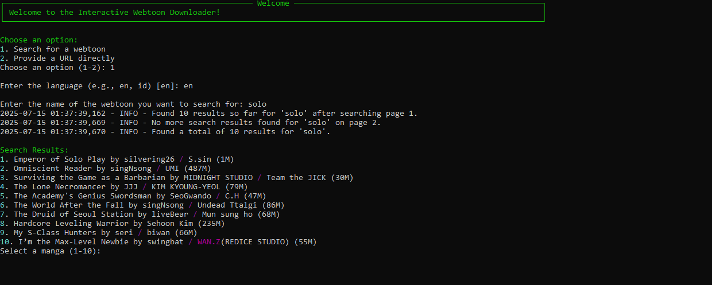

# 📘 Webtoons Downloader

[](https://www.python.org/downloads/)
[](https://opensource.org/licenses/MIT)
[](https://github.com/Yui007/webtoons_downloader/stargazers)
[](https://github.com/Yui007/webtoons_downloader/network)

A powerful and user-friendly tool to download your favorite comics from [Webtoons.com](https://www.webtoons.com/), featuring both a sleek GUI and a versatile CLI. Save your favorite series for offline reading in PDF, CBZ, or raw image formats.

---

## ✨ Features

-   **Dual Interface**: Choose between a beautiful Graphical User Interface (GUI) or a powerful Command-Line Interface (CLI).
-   **Flexible Downloading**:
    -   Search for any webtoon by title.
    -   Download directly using the webtoon's URL.
    -   Download all chapters, a specific range, or a single chapter.
-   **High Performance**: Utilizes parallel downloading to fetch multiple chapters at once, saving you time.
-   **Multiple Formats**: Save chapters as PDF, CBZ, or keep the raw images.
-   **Multi-Language Support**: Search and download webtoons in different languages.
-   **Automatic Cleanup**: Option to automatically delete raw image folders after conversion.
-   **Responsive & Modern UI**: The GUI is designed to be intuitive and aesthetically pleasing, with asynchronous operations to prevent freezing.

---

## 🖥️ Graphical User Interface (GUI)

The GUI provides an intuitive and rich experience for downloading webtoons.


For detailed instructions on how to use the GUI, please see the **[GUI Usage Guide](GUI_usage.md)**.

---

## ⌨️ Command-Line Interface (CLI)

The CLI is perfect for automation, scripting, or for those who prefer working in the terminal. It supports two modes:

-   **Argument-based**: Perform any action in a single command.
-   **Interactive**: A step-by-step guided experience.



### Quick Examples

**Search for a webtoon:**
```bash
python main.py --search "Love"
```

**Download a range of chapters in PDF format:**
```bash
python main.py --url "https://www.webtoons.com/en/fantasy/the-lone-necromancer/list?title_no=3690" --download --range 1-10 --format pdf
```

**Start the interactive mode:**
```bash
python main.py --interactive
```

For a complete list of commands and options, please refer to the **[CLI Usage Guide](CLI_usage.md)**.

---

## 🚀 Getting Started

### Prerequisites

-   Python 3.9 or higher

### Installation

1.  **Clone the repository:**
    ```bash
    git clone https://github.com/Yui007/webtoons_downloader.git
    cd webtoons_downloader
    ```

2.  **Install the required dependencies:**
    ```bash
    pip install -r requirements.txt
    ```

### Running the Application

-   **To launch the GUI:**
    ```bash
    python main.py --gui
    ```
-   **To use the CLI:**
    ```bash
    python main.py --help
    ```

---

## 🤝 Contributing

Contributions are what make the open-source community such an amazing place to learn, inspire, and create. Any contributions you make are **greatly appreciated**.

1.  Fork the Project
2.  Create your Feature Branch (`git checkout -b feature/AmazingFeature`)
3.  Commit your Changes (`git commit -m 'Add some AmazingFeature'`)
4.  Push to the Branch (`git push origin feature/AmazingFeature`)
5.  Open a Pull Request

---

## 📄 License

This project is licensed under the MIT License. See the [LICENSE](LICENSE) file for details.
